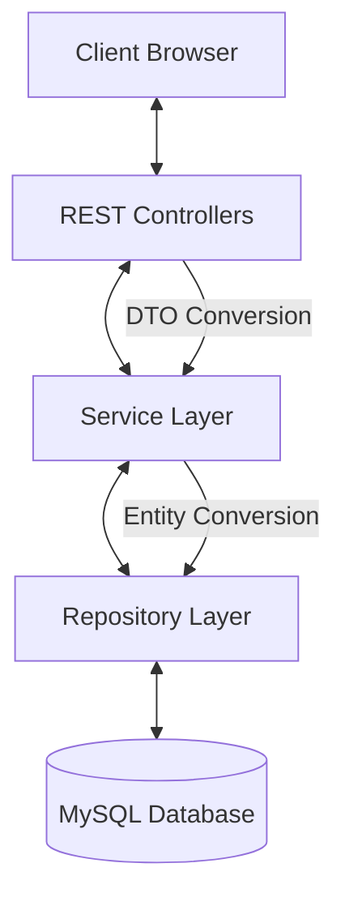
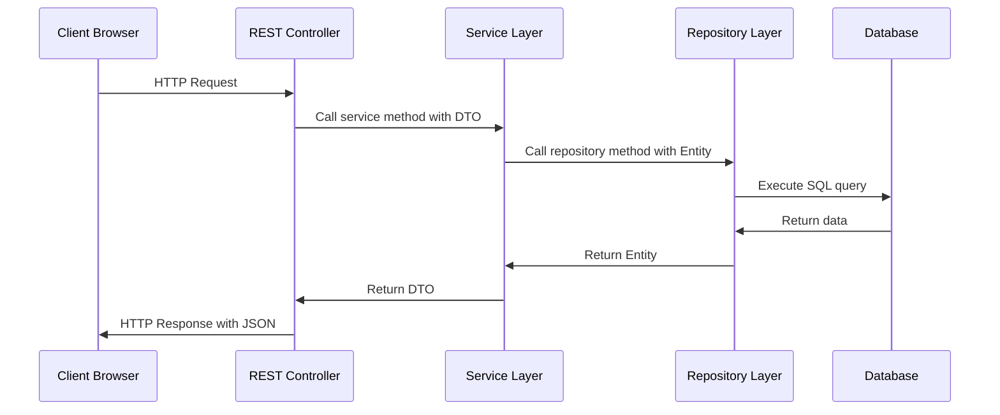
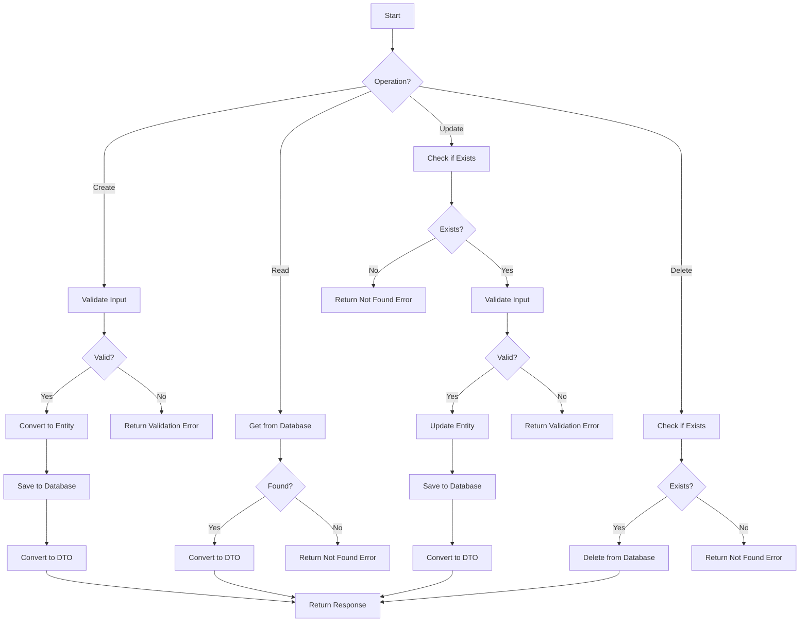
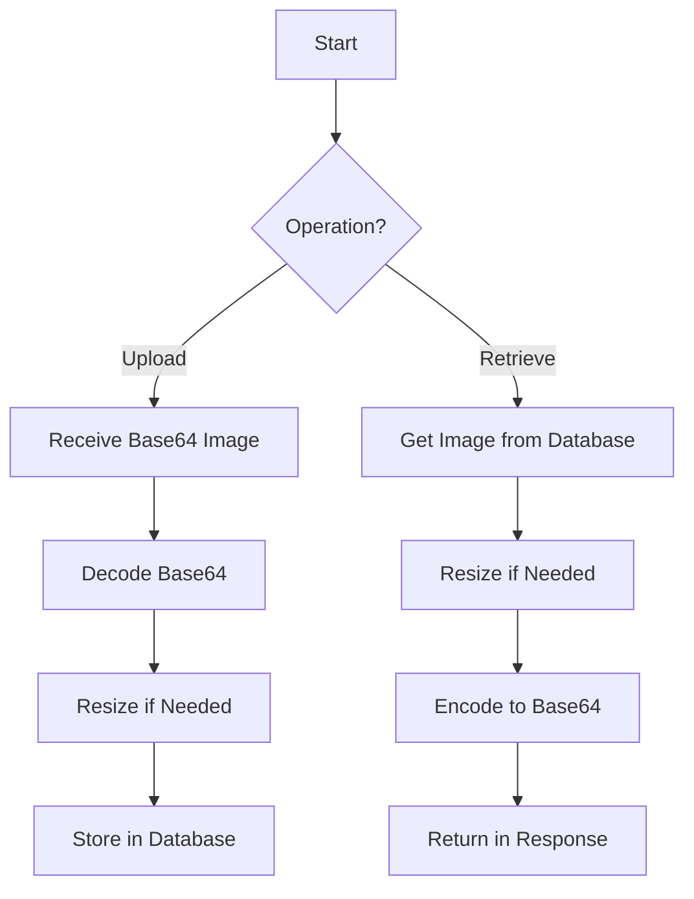
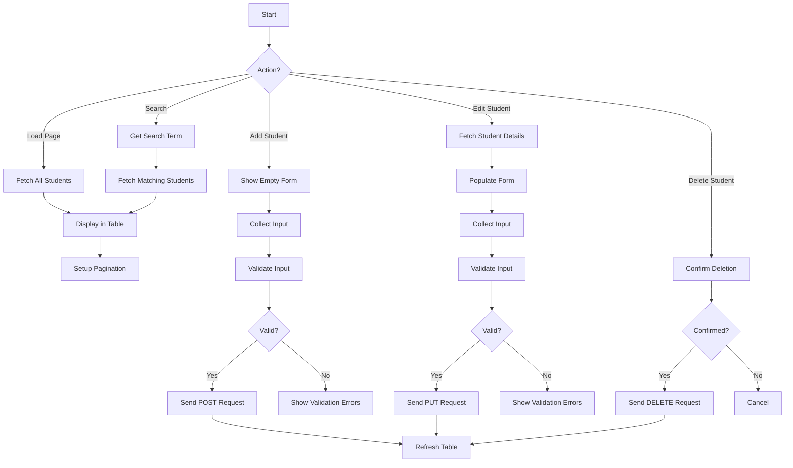

# Student Management System - Application Flow

## System Architecture

```mermaid
graph TD
    Client[Client Browser] <--> Controller[REST Controllers]
    Controller <--> Service[Service Layer]
    Service <--> Repository[Repository Layer]
    Repository <--> DB[(MySQL Database)]
    
    Controller -- DTO Conversion --> Service
    Service -- Entity Conversion --> Repository
```

## API Request Flow

```mermaid
sequenceDiagram
    participant Client as Client Browser
    participant Controller as REST Controller
    participant Service as Service Layer
    participant Repository as Repository Layer
    participant DB as Database
    
    Client->>Controller: HTTP Request
    Controller->>Service: Call service method with DTO
    Service->>Repository: Call repository method with Entity
    Repository->>DB: Execute SQL query
    DB->>Repository: Return data
    Repository->>Service: Return Entity
    Service->>Controller: Return DTO
    Controller->>Client: HTTP Response with JSON
```

## Student CRUD Operations

```mermaid
flowchart TD
    A[Start] --> B{Operation?}
    
    B -->|Create| C[Validate Input]
    C --> C1{Valid?}
    C1 -->|Yes| D[Convert to Entity]
    C1 -->|No| C2[Return Validation Error]
    D --> E[Save to Database]
    E --> F[Convert to DTO]
    F --> G[Return Response]
    
    B -->|Read| H[Get from Database]
    H --> H1{Found?}
    H1 -->|Yes| I[Convert to DTO]
    H1 -->|No| H2[Return Not Found Error]
    I --> G
    
    B -->|Update| J[Check if Exists]
    J --> J1{Exists?}
    J1 -->|Yes| K[Validate Input]
    J1 -->|No| J2[Return Not Found Error]
    K --> K1{Valid?}
    K1 -->|Yes| L[Update Entity]
    K1 -->|No| K2[Return Validation Error]
    L --> M[Save to Database]
    M --> N[Convert to DTO]
    N --> G
    
    B -->|Delete| O[Check if Exists]
    O --> O1{Exists?}
    O1 -->|Yes| P[Delete from Database]
    O1 -->|No| O2[Return Not Found Error]
    P --> G
```

## Image Processing Flow

```mermaid
flowchart TD
    A[Start] --> B{Operation?}
    
    B -->|Upload| C[Receive Base64 Image]
    C --> D[Decode Base64]
    D --> E[Resize if Needed]
    E --> F[Store in Database]
    
    B -->|Retrieve| G[Get Image from Database]
    G --> H[Resize if Needed]
    H --> I[Encode to Base64]
    I --> J[Return in Response]
```

## Frontend Data Flow

```mermaid
flowchart TD
    A[Start] --> B{Action?}
    
    B -->|Load Page| C[Fetch All Students]
    C --> D[Display in Table]
    D --> E[Setup Pagination]
    
    B -->|Search| F[Get Search Term]
    F --> G[Fetch Matching Students]
    G --> D
    
    B -->|Add Student| H[Show Empty Form]
    H --> I[Collect Input]
    I --> J[Validate Input]
    J --> J1{Valid?}
    J1 -->|Yes| K[Send POST Request]
    J1 -->|No| J2[Show Validation Errors]
    K --> L[Refresh Table]
    
    B -->|Edit Student| M[Fetch Student Details]
    M --> N[Populate Form]
    N --> O[Collect Input]
    O --> P[Validate Input]
    P --> P1{Valid?}
    P1 -->|Yes| Q[Send PUT Request]
    P1 -->|No| P2[Show Validation Errors]
    Q --> L
    
    B -->|Delete Student| R[Confirm Deletion]
    R --> R1{Confirmed?}
    R1 -->|Yes| S[Send DELETE Request]
    R1 -->|No| R2[Cancel]
    S --> L
```
